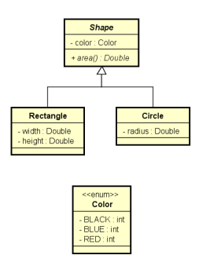
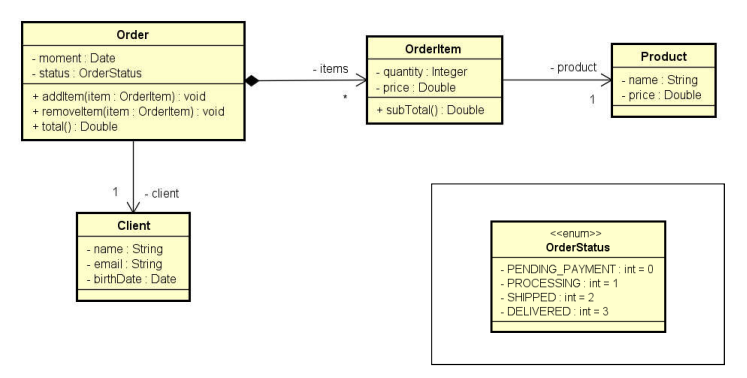
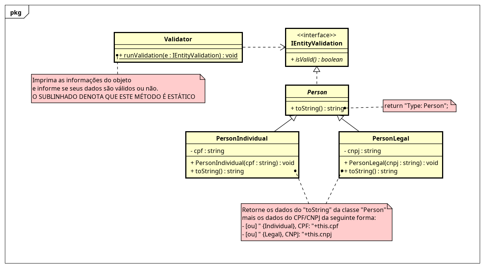
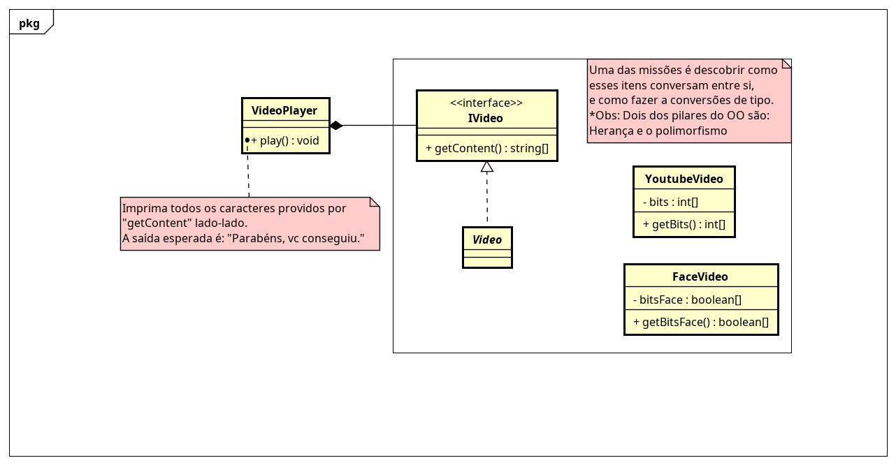

# Programação Orientada a Objetos - UFAL - 2022_1


----

## Lista de Exercício 1

**Assunto**: Fundamentos da Orientação a Objeto

**Data de Entrega**: n/d.

**Por**: Franklyn Roberto, Ramon Almeida e Thiago Sales

**Apoio:**
- [Diagramas UML](./UML/)
- Resolução: n/d
- Repositório: <https://github.com/jytaloramon/poo-ufal-2022_1/tree/main/List-1>
----
<br>

### **Exercício 1:** 
Faça um programa para ler a cotação do dólar, e depois leia o valor em dólares a ser comprado. A saída será quantos reais a pessoa pagará pelos dólares, considerando ainda que a pessoa pagará 6% de IOF sobre o valor em dólar. Criar uma classe CurrencyConverter (Conversor de moeda) para ser responsável pelos cálculos.

#### Exemplo main:
```java
public class Program {
       public static void main(String[] args) {
              Locale.setDefault(Locale.US);
              Scanner sc = new Scanner(System.in);

              System.out.print("What is the dollar price? ");
              double dollarPrice = sc.nextDouble();
              System.out.print("How many dollars will be bought? ");
              double amount = sc.nextDouble();
              
              double result = CurrencyConverter.dollarToReal(amount, dollarPrice);
              System.out.printf("Amount to be paid in reais = %.2f%n", result);
              sc.close();
       }
}
```

#### Exemplo de entrada:
```
What is the dollar price? 3.10 

How many dollars will be bought? 200.00
```

#### Saída:
```
Amount to be paid in reais = 657.20
```
---

### **Exercício 2:** 
Fazer um programa para ler os valores da largura e altura de um retângulo. Em seguida, mostrar na tela o valor de sua área, perímetro e diagonal. Usar uma classe como mostrado no projeto abaixo.

|       **Rectangle**       |
| :-----------------------: |
|    __-__ Width: double    |
|   __-__ Height: double    |
|            ---            |
|   __+__ Area(): double    |
| __+__ Perimeter(): double |
| __+__ Diagonal(): double  |

#### Exemplo main:
```java
public class Program {
       public static void main(String[] args) {
              Locale.setDefault(Locale.US);
              Scanner sc = new Scanner(System.in);

              Rectangle rect = new Rectangle();

              System.out.println("Enter rectangle width and height:");
              rect.width = sc.nextDouble();
              rect.height = sc.nextDouble();

              System.out.printf("AREA = %.2f%n", rect.area());
              System.out.printf("PERIMETER = %.2f%n", rect.perimeter());
              System.out.printf("DIAGONAL = %.2f%n", rect.diagonal());
              sc.close();
       }
}
```

#### Exemplo de entrada:

```
Enter rectangle width and height:

3.00
4.00
``` 

#### Saída:
```
AREA = 12.00 
PERIMETER = 14.00 
DIAGONAL = 5.00
```
----

### **Exercício 3:** 

Crie um programa para ler os dados de um funcionário (nome, sálario bruto e imposto). Em seguida, mostrar os dados do funcionário (nome e salário líquido). Em seguida, aumentar o salário do funcionário com base em uma porcentagem dada (somente o salário bruto é afetado pela porcentagem) e mostrar novamente os dados do funcionário. Use a classe projetada abaixo.

|                  **Employee**                  |
| :---------------------------------------------: |
|               __-__ Name: String                |
|            __-__ GrossSalary: double            |
|                __-__ Tax: double                |
|                       ---                       |
|            __+__ NetSalary(): double            |
| __+__ IncreaseSalary(percentagem: double): void |

#### Exemplo main:
```java
public class Program {
       public static void main(String[] args) {
              Locale.setDefault(Locale.US);
              Scanner sc = new Scanner(System.in);

              Employee emp = new Employee();

              System.out.print("Name: ");
              emp.name = sc.nextLine();
              System.out.print("Gross salary: ");
              emp.grossSalary = sc.nextDouble();
              System.out.print("Tax: ");
              emp.tax = sc.nextDouble();

              System.out.println();
              System.out.println("Employee: " + emp);
              System.out.println();
              System.out.print("Which percentage to increase salary? ");
              double percentage = sc.nextDouble();
              emp.increaseSalary(percentage);

              System.out.println();
              System.out.println("Updated data: " + emp);
              sc.close();
       }
}
```

#### Exemplo de entrada:
```
Name: Joao Silva
Gross salary: 6000.00
Tax: 1000.00
Employee: Joao Silva, $ 5000.00
Which percentagem to increase salary? 10.0
```

#### Saída:
```
Updated data: Joao Silva, $ 5600.00
```
---

### **Exercício 4:** 
Fazer um programa para ler os dados de N figuras (N fornecido pelo usuário), e depois mostrar as áreas destas figuras na mesma ordem em que foram digitadas.
Obs: Shape é uma classe abstract.
<div>
    
</div>

#### Exemplo de entrada:
``` markdown
Enter the number of shapes: 2

**Shape #1 data:**
Rectangle or Circle (r/c)? r 
Color (BLACK/BLUE/RED): BLACK
Width: 4.0 
Height: 5.0

**Shape #2 data:** 
Rectangle or Circle (r/c)? c 
Color (BLACK/BLUE/RED): RED 

Radius: 3.0
``` 

#### Saída:
```
SHAPE AREAS: 

20.00
28.27
```

---

### **Exercício 5:** 
Faça um programa que ler os dados de um pedido com N itens (N fornecido pelo usuário). Depois, mostrar um sumário do pedido conforme exemplo (próxima página). Nota: o instante do pedido deve ser o instante do sistema: new Date()

Use o *SimpleDateFormat*
```java
SimpleDateFormat sdf = new SimpleDateFormat("dd/MM/yyyy");
```


<div>
    
</div>

#### Exemplo main:
```java
public class Program {

	public static void main(String[] args) throws ParseException {
		
		Locale.setDefault(Locale.US);
		Scanner sc = new Scanner(System.in);
		SimpleDateFormat sdf = new SimpleDateFormat("dd/MM/yyyy");

		System.out.println("Enter client data:");
		System.out.print("Name: ");
		String name = sc.nextLine();
		System.out.print("Email: ");
		String email = sc.next();
		System.out.print("Birth date (DD/MM/YYYY): ");
		Date birthDate = sdf.parse(sc.next());
		
		Client client = new Client(name, email, birthDate);
		
		System.out.println("Enter order data:");
		System.out.print("Status: ");
		OrderStatus status = OrderStatus.valueOf(sc.next());
		
		Order order = new Order(new Date(), status, client);
		
		System.out.print("How many items to this order? ");
		int n = sc.nextInt();
		for (int i=1; i<=n; i++) {
			System.out.println("Enter #" + i + " item data:");
			System.out.print("Product name: ");
			sc.nextLine();
			String productName = sc.nextLine();
			System.out.print("Product price: ");
			double productPrice = sc.nextDouble();

			Product product = new Product(productName, productPrice);

			System.out.print("Quantity: ");
			int quantity = sc.nextInt();

			OrderItem orderItem = new OrderItem(quantity, productPrice, product); 

			order.addItem(orderItem);
		}
		
		System.out.println();
		System.out.println("ORDER SUMMARY:");
		System.out.println(order);
		
		sc.close();
	}
}
```

#### Exemplo de Entrada:

```markdown
**Enter cliente data:** 
Name: Joao Felipe
Email: joao@gmail.com
Birth date (DD/MM/YYYY): 15/03/1985

**Enter order data:** 
Status: PROCESSING
How many items to this order? 2

**Enter #1 item data:**
Product name: TV
Product price: 1000.00
Quantity: 1

**Enter #2 item data:**
Product name: Mouse
Product price: 40.00

Quantity: 2
``` 


#### Saída:
```
ORDER SUMMARY:

Order moment: 12/09/2022 11:25:09 
Order status: PROCESSING 
Client: Joao Felipe (15/03/1985) - joao@gmail.com 
Order items: 
TV, $1000.00, Quantity: 1, Subtotal: $1000.00 
Mouse, $40.00, Quantity: 2, Subtotal: $80.00 
Total price: $1080.00
```
---

### **Exercício 6:**

Seguindo o diagrama UML abaixo, crie um software para validar dados de pessoa física e jurídica, caracterizados aqui por *CPF* E *CNPJ*, respectivamente. Consulte páginas na internet para saber a fórmula de cálculo para cada um deles. As entradas estarão sempre no formato *XXX.XXX.XXX-XX* para CPF e *XX.XXX. XXX/0001-XX* para CNPJ.

<div>
    
</div>

#### Saída:

```markdown
Crie o método main e instancie alguns objetos do tipo Person->PersonIndividual/PersonLegal (pelo menos dois de cada) e valide através do Validator.
```

---

### **Exercício 7:**

Você foi contratado para desenvolver um Player de Vídeo para uma BigTech. Dentre os problemas na construção deste software está o requisito de que o player deve suporta vídeos independentes da fonte/origem. A questão aqui é, empresas diferentes codificam os binários dos vídeos de forma diferente. Como mostrado no diagrama UML abaixo, os "bits" da classe *YoutubeVideo* são representados na forma de um array de inteiros, já *FaceVideo* é um array de booleanos. Sua tarefa é codificar este software atendendo o requisito mencionado.

O formato de conversão segue a seguinte lógica:
- YoutubeVideo: basta obter cada valor(inteiro) do array e mapeá-lo para um caractere utilizando a tabela ASCII (existe método em Java para isso). 

- FaceVideo: o array (de bits) tem exatamente 184 itens, esses elementos devem ser agrupados 8-8, formando assim 23 grupos/caracteres. Esse agrupamento representa na realidade um valor binário - só que no lugar de 1 e 0 é True e False. Tomando os 8 primeiros itens do array como exemplo:
(false, true, false, true, false, false, false, false) = (0b 01010000) = 80. Agora você tem inteiros (o que fará com eles?).

- [Código: FaceVideo.java e YoutubeVideo.java](#código-fonte-necessário)

<div>
    
    <i>Esboço do diagrama UML do projeto. Ao construir seu software modifique-o se necessário sem descaracterizar o modelo.</i>
</div>

<br>

#### Código Fonte: 
```Java
// FaceVideo.java

package face;

public class FaceVideo {

    private final boolean[] bitsFace;

    public FaceVideo() {
       bitsFace = new boolean[] {
              false, true, false, true, false, false, false, false, false, true, true, false, false, false, false,
              true, false, true, true, true, false, false, true, false, false, true, true, false, false, false, false,
              true, false, true, true, false, false, false, true, false, true, true, true, false, true, false, false,
              true, false, true, true, false, true, true, true, false, false, true, true, true, false, false, true,
              true, false, false, true, false, true, true, false, false, false, false, true, false, false, false,
              false, false, false, true, true, true, false, true, true, false, false, true, true, false, false, false,
              true, true, false, false, true, false, false, false, false, false, false, true, true, false, false,
              false, true, true, false, true, true, false, true, true, true, true, false, true, true, false, true,
              true, true, false, false, true, true, true, false, false, true, true, false, true, true, false, false,
              true, false, true, false, true, true, false, false, true, true, true, false, true, true, true, false,
              true, false, true, false, true, true, false, true, false, false, true, false, true, true, true, false,
              true, false, true, false, false, true, false, true, true, true, false
       };
    }

    public boolean[] getBitsFace() {
        return bitsFace;
    }

}
```

```Java
// YoutubeVideo.java

package youtube;

public class YoutubeVideo {

    private final int[] bits;

    public YoutubeVideo() {
       bits = new int[] {
              80, 97, 114, 97, 98, 233, 110, 115, 44,
              32, 118, 99, 32, 99, 111, 110, 115, 101,
              103, 117, 105, 117, 46
        };
    }

    public int[] getBits() {
       return bits;
    }

}
```

#### Saída:
```markdown
Para alcançar o objetivo você deve conseguir apresentar/imprimir a mensagem “Parabéns, vc conseguiu.” a partir dos “bits” providos pelas classes “YoutubeVideo” e “FaceVideo”.
```
----

### **Exercício 8:**

O prof. Thiago neste período lecionará a disciplina de Programação Orientada a Objeto(POO). Devido a experiências ruins com alunos que não estudavam o suficiente – ou não estudava – ele pensou em uma nova fórmula para calcular as notas dos alunos (modo tudo ou nada). 

- Nota semestral: média aritmética das notas obtidas pelo aluno.
- Nota final: nota obtida a partir da **nota semestral** aplicando o **modo tudo ou nada**

Em relação a nota semestral:
- Nota menor que 6 recebe uma penalização de 25%.
- Maior ou igual a 6 e menor que 7 se torna 7.
- Maior ou igual a 7 e menor ou igual a 8 recebe uma bonificação de 15% (Para melhorar o coeficiente).
- Qualquer outra nota automaticamente se torna 10.

Sua atividade é desenvolver um software para realizar esse cálculo. Além disso, o seu sistema deve-se armazenar algumas outras informações.

##### Aluno:

|     Campo      | Restrição                                         |
| :------------: | :------------------------------------------------ |
| Nome completo  | Ter pelo menos dois nomes<br>Máximo 50 caracteres |
|   Matrícula    | Ter 8 recebidocaracteres<br>Iniciar com 201       |
| notas do aluno | 5 notas no total                                  |

Sobre a nota semestral: a menor nota do aluno será descartada para fins de calculo, que consiste de uma média aritmética da 4 notas restantes.


##### Nota:

|      Campo      | Restrição          |
| :-------------: | :----------------- |
|      Valor      | 0 <= valor <= 10   |
| Nome do Assunto | Não pode ser vázio |


Cuidados: encapsule as propriedades e faça as validaçções dos valores "setados" nos campos.

Obs.1: utilize interfaces.

Obs.2: pode ser necessário atualizar dados após sua criação.

#### Saída:

```markdown
Crie o método main e instancie alguns objetos do tipo Aluno (no mínimo 5) com suas respectivas notas.
Para cada um imprima: matrícula, nome, notas obtidas (valor e nome do assunto), "nota semestral" e a "nota final".
```
----

### **Exercício 9:**

Nessa atividade sua tarefa será criar uma *lib* de ordenação.

A exigência principal é que haja uma classe chamada de *SortMachine* que receberá uma lista – você pode escolher qual o tipo será essa lista (int, string, etc) – idealmente genérica – e um o método de ordenação (Quick, Merge, etc). Em *SortMachine* haverá um método nomeado *runSort* que retornará a lista ordenada.

Obs.1: você deverá implementar pelos menos dois algoritmos de ordenação diferentes.

#### Saída

```markdown
Crie o método *main*, uma lista de itens, instancie *SortMachine* e suas dependências e execute a ordenação.
```
----

### **Exercício 10:**

José é dono de uma rede de empresas do ramo alimentícios que além de vender produtos de terceiros a também cria seus próprios produtos. Atualmente, o principal meio de comunicação da empresa é o e-mail, entretanto, José tem receio que alguma BigTech vaze/roube informações sobre os seus produtos. Diante disso, ele está te contratando para construir um sistema de e-mail próprio para a empresa.

Problemas/Requisitos:

1. Um e-mail é uma mensagem de texto com no máximo 2500 caracteres e possui um usuário de origem e um de destino que sejam válidos, além de um título e uma data de envio.
2. Um Funcionário possui nome, cargo, matrícula e um e-mail. O e-mail deve ser único dentro do sistema da empresa. Além disso, cada Funcionário possui uma lista de e-mails enviados e uma lista de recebidos.
3. Para facilitar a localização, José requisita que haja uma lista com todos os Funcionários.
4. Crie uma unidade/classe responsável por enviar e-mails entre os Funcionários.

#### Saída

```markdown
No método *main:
- instancie os objetos e suas dependências.
- Efetue o envio de e-mails entre Funcionário.
- Imprima a lista dos Funcionários: nome, matrícula, cargo, e-mails enviados (conteúdo e nome do destinatário) e e-mails recebidos (conteúdo e nome do remetente).
```
