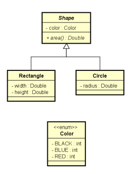
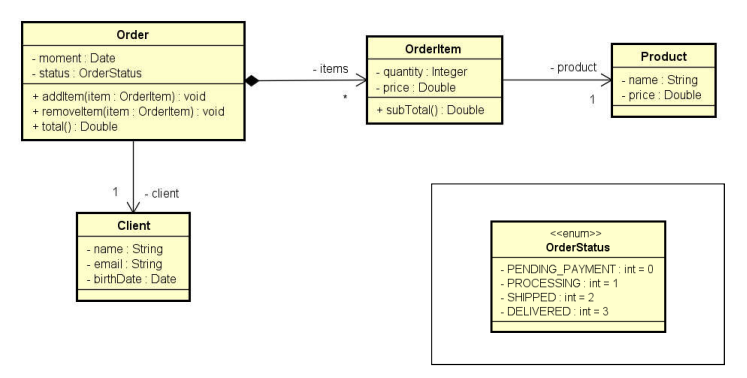

# Programação Orientada a Objetos - UFAL - 2022_1


## Repositório da disciplina de POO - UFAL 2022.1


- Obs: As letras, números e símbolos em ```NEGRITO``` são os valores que vão digitar no programa.

---
### **Exercício 1:** 
Faça um programa para ler a cotação do dólar, e depois um valor em dólares a ser comprado por uma pessoa em reais. Informar quantos reais a pessoa vai pagar pelos dólares, considerando ainda que a pessoa terá que pagar 6% de IOF sobre o valor em dólar. Criar uma classe CurrencyConverter (Conversor de moeda) para ser responsável pelos cálculos

### Exemplo de entrada:
What is the dollar price?```3.10```

How many dollars will be bought?```200.00``` 
### Exemplo de saída:
```
Amount to be paid in reais = 657.20
```

---
### **Exercício 2:** 
Fazer um programa para ler os valores da largura e altura de um retângulo. Em seguida, mostrar na tela o valor de sua área, perímetro e diagonal. Usar uma classe como mostrado no projeto abaixo.

| **Rectangle**
:------:
 __-__ Width: double
 __-__ Height: double
 ---|
__+__ Area(): double
__+__ Perimeter(): double
__+__ Diagonal(): double


### Exemplo de entrada:

Enter rectangle width and height:

```3.00``` 

```4.00``` 
### Exemplo de saída:
```
AREA = 12.00 
PERIMETER = 14.00 
DIAGONAL = 5.00
```

---
### **Exercício 3:** 
Fazer um programa para ler os dados de um funcionário (nome, sálario bruto e imposto). Em seguida, mostrar os dados do funcionário (nome e salário líquido). Em seguida, aumentar o salário do funcionário com base em uma porcentagem dada (somente o salário bruto é afetado pela porcentagem) e mostrar novamente os dados do funcionário. Use a classe projetada abaixo.

| **Rectangle**
:------:
__-__ Name: String
__-__ GrossSalary: double
__-__ Tax: double
---|
__+__ NetSalary(): double
__+__ IncreaseSalary(percentagem: double): void

### Exemplo de entrada:

Name: ```Joao Silva```

Gross salary: ```6000.00```

Tax: ```1000.00```

Employee: Joao Silva, $ 5000.00

Which percentagem to increase salary? ```10.0```

### Exemplo de saída:
```
Updated data: Joao Silva, $ 5600.00
```

---

### **Exercício 4:** 
Fazer um programa para ler os dados de N figuras (N fornecido pelo usuário), e depois mostrar as áreas destas figuras na mesma ordem em que foram digitadas.
Obs: Shape é uma classe abstract.
<div>
    
</div>

### Exemplo de entrada:
Enter the number of shapes: ```2```

**Shape #1 data:** 

Rectangle or Circle (r/c)? ```r``` 

Color (BLACK/BLUE/RED): ```BLACK```

Width: ```4.0``` 

Height: ```5.0``` 

**Shape #2 data:** 

Rectangle or Circle (r/c)? ```c``` 

Color (BLACK/BLUE/RED): ```RED``` 

Radius: ```3.0``` 
### Exemplo de saída:
```
SHAPE AREAS: 

20.00
28.27
```

---
### **Exercício 5:** 
Faça um programa que ler os dados de um pedido com N itens (N fornecido pelo usuário). Depois, mostrar um sumário do pedido conforme exemplo (próxima página). Nota: o instante do pedido deve ser o instante do sistema: new Date()
<div>
    
</div>

### Exemplo de Entrada:
**Enter cliente data:** 

Name: ```Joao Felipe``` 

Email: ```joao@gmail.com``` 

Birth date (DD/MM/YYYY): ```15/03/1985```

**Enter order data:** 

Status: ```PROCESSING```

How many items to this order? ```2```

**Enter #1 item data:**

Product name: ```TV```

Product price: ```1000.00```

Quantity: ```1``` 

**Enter #2 item data:**

Product name: ```Mouse``` 

Product price: ```40.00``` 

Quantity: ```2``` 


### Exemplo de saída:
```
ORDER SUMMARY:
Order moment: 12/09/2022 11:25:09 
Order status: PROCESSING 
Client: Joao Felipe (15/03/1985) - joao@gmail.com 
Order items: 
TV, $1000.00, Quantity: 1, Subtotal: $1000.00 
Mouse, $40.00, Quantity: 2, Subtotal: $80.00 
Total price: $1080.00
```
